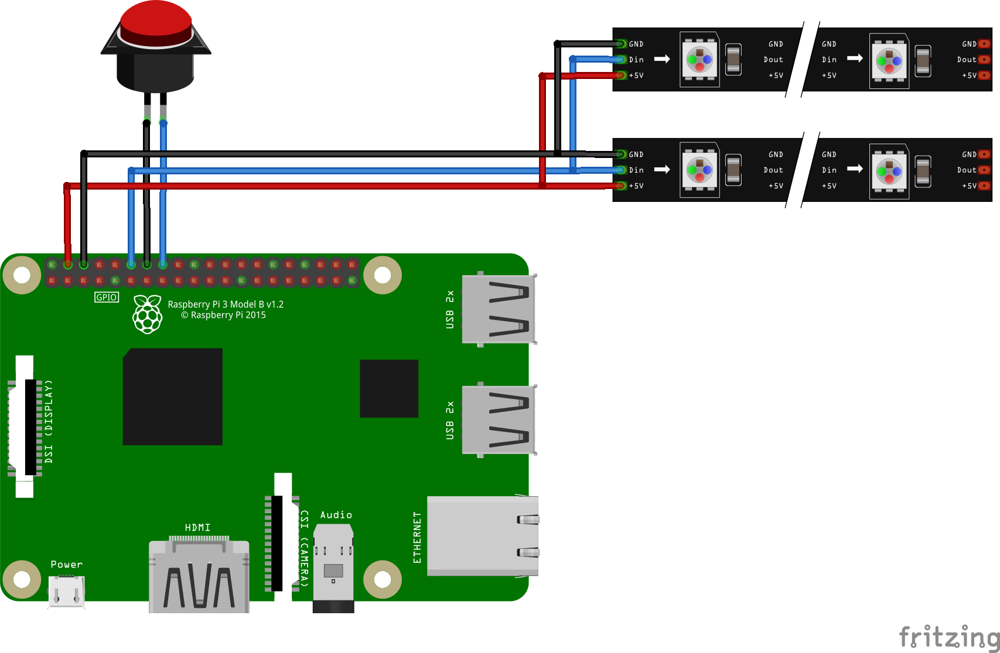

# photobooth
RaspberryPi Photobooth software written in Python using [Adafruit Neopixels](https://www.adafruit.com/category/168) and a [Raspberry Pi Camera](https://www.raspberrypi.org/help/camera-module-setup/).

# What is this?
This is a software and hardware implementation for a photobooth, where people can create stop motion gifs. For this people can sit infront of a camera and start the capture process by pressing a hardware button. Then the software takes an predefined amount of pictures and generates a gif. This gif is then played and can be uploaded to an online service. To guide the user, there are also visualizations using a display and Neopixel LEDs.

Also check the flyer in [english](/media/flyer.pdf) and [german](/media/flyer-de.pdf).

# What do you need?

## Full version
First of all you need a **Raspberry Pi**. I would recommend a **RPi 3 Rev. B**, since the older version are slower and the gif generations takes longer. Therefore the user experience might is worse. Also you need the mandatory hardware for the Raspberry Pi: an **microUSB power adapter with 5V and atleast 2A** & a **microSD card with atleast 16GB** memory. Also a mouse and keyboard for debugging. And a LAN cable if you dont use Wifi.

To print the receipts you need:
* an **Arduino Uno** (or similar). Sadly the RPi 3 does not support direct serial communication with the printer
* an **[Adafruit Mini Thermal Receipt Printer](https://www.adafruit.com/product/597)**
* an **USB A-B cable** to connect the Arduino Uno to the RPi (or different USB cable if you use another Arduino board)

Next you need some other Hardware: 
* a **display with HDMI** and an HDMI cable connected to the RPi. You can use an old **laptop display with LVDS** (most displays use LVDS, but you should make sure, yours does as well) and a **LVDS converter board**
* a **[Raspberry Pi camera](https://www.raspberrypi.org/help/camera-module-setup/)**
* some **hardware buttons and cables**
* two **[Neopixel strips with 8 pixels](https://www.adafruit.com/products/1460)** (you can use any other amount or length)

Also you need an **webserver** for the website supporting PHP and ImageMagick.

## Modifications

You can also modify the setup to satisfy your needs. 

You can get rid of the Arduino, a) if you use an older Raspberry Pi Version (like the RPi 2). This will result in slower gif generation. Or b) if you get rid of the printer aswell. In this case you should also get rid of the serial code inside the python script.

You can get rid of the webserver and only save the images locally. For this you should remove the requests from the python script.

You can remove the logos from the images by removing the *gm composite* command from the python script.

You can modify the text by modifying the *CAMERA_TEXTVAL_?* values. You can modify the timings by modyfying the *?_WAIT* values. You can modify the color strip colors by modifying the *COLOR_?* values.

# Hardware setup

Connect the hardware from above to the Raspberry Pi. Plug in the display and the input devices. Connect the camera to the camera port on the RPi. Connect the button and Neopixels according to the Fritzing layout below.

# Installation

Get your Raspberry Pi working with Raspbian following [the official tutorials](https://www.raspberrypi.org/help/quick-start-guide/).

Install the neopixel library from [Adafruit and jgarff](https://github.com/jgarff/rpi_ws281x). There are more [informations and examples here](https://learn.adafruit.com/neopixels-on-raspberry-pi/software).

Install other needed software using the installation script in the `installation` folder.

Start by calling the camera.py as root: `sudo python single_instance.py`

# Prevent Display Blanking

By default, the display will be turned off after a few moments. You wont notice this when the preview is open, because it overlays the blank screen somehow. But the replay of the gif wont work. So we need to address and fix that. I found two possible solutions which work on different devices. Try one or both of them. [Check the solutions from Foggy and Rasadmin here.](https://www.raspberrypi.org/forums/viewtopic.php?f=66&t=18200)

First solution (by Foggy):

1. Open the kbd config file: `sudo nano /etc/kbd/config`
2. Change `BLANK_TIME` and `POWERDOWN_TIME` to `0` (zero)
3. Restart the file using `sudo /etc/init.d/kbd restart` or reboot your RPi

Second solution (by Rasadmin):

1. Open the lightdm config file: `sudo nano /etc/lightdm/lightdm.conf`
2. Find the header `[SeatDefault]` and insert `xserver-command=X -s 0 dpms` below that header
3. Reboot your RPi
